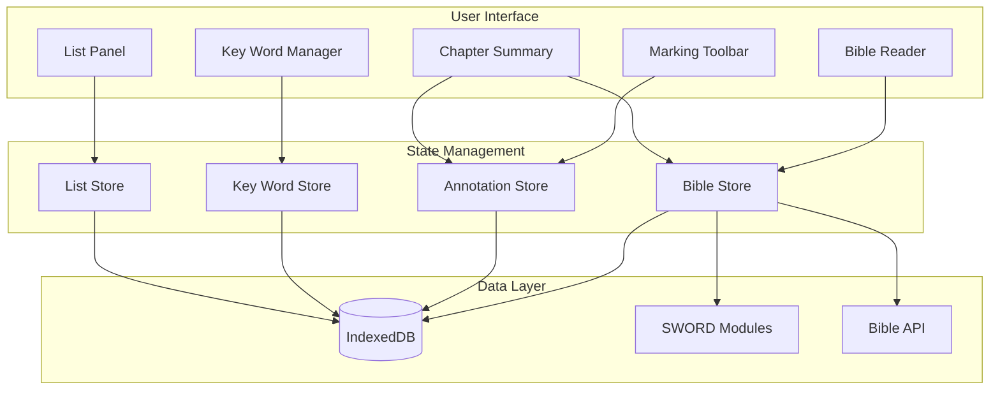

# Bible Study App - Project Plan

## Current State Summary

The app already has a solid foundation:

- **Bible Reading**: Chapter/verse navigation with SWORD module support (WEB, KJV, ASV bundled)
- **Marking System**: Complete highlighting, text color, underline, and symbol annotations
- **Section Headings & Chapter Titles**: User-created headings before verses
- **Notes**: Markdown-supported notes attached to verses
- **Smart Suggestions**: Previously-used markings suggested for repeated words
- **Persistence**: IndexedDB via Dexie for all user data

---

## Phase 1: Bible API Integration (NASB/ESV)

### API Recommendation

After researching the options, **Biblia API** (by Faithlife/Logos) is the best fit:

- Has both **NASB** and **ESV** available
- Free tier: 5,000 calls/day (sufficient for personal use)
- Well-documented REST API
- Allows caching for offline use

Alternative: **ESV API** (Crossway) for ESV-only with generous limits.

### ESV API Compliance Guidelines

**CRITICAL**: The following guidelines must be followed when using the ESV API:

1. **Copyright Citation**: Must be included as outlined in ESV API documentation
2. **Noncommercial Use Only**: Use must be strictly noncommercial
3. **Query Limits**:
   - Up to 500 verses per query, or half a book, whichever is less (excepting single-chapter books)
   - Maximum 5,000 queries per day
   - Maximum 1,000 requests per hour
   - Maximum 60 requests per minute
   - If limits are exceeded, the application will be throttled
4. **Local Storage Limits**:
   - May not locally store more than 500 consecutive verses
   - May not store more than one-half of any book of the Bible (whichever is less)
5. **Display Limits**:
   - May not display more than 500 consecutive verses or one-half of any book (whichever is less) on any page
6. **Redistribution**:
   - Text may be redistributed (e.g., via email or RSS feed)
   - May distribute up to 500 verses
   - Verses quoted must not amount to 50% of a complete book
   - Verses must not make up 50% or more of the total text of the work in which they are quoted

**Implementation Requirements**:
- Implement rate limiting in ESV API client (60/min, 1000/hour, 5000/day)
- Add verse count validation before fetching (max 500 verses per query)
- Ensure copyright citation is displayed when using ESV text
- Add checks to prevent storing/displaying more than allowed verses
- Cache management must respect storage limits

### Implementation

- Create [`src/lib/bible-api/`](src/lib/bible-api/) module with provider abstraction
- Support multiple providers (Biblia, ESV API, SWORD fallback)
- Cache fetched chapters in IndexedDB for offline reading
- Add API key configuration in settings (stored locally)
- **Implement ESV API compliance checks** (rate limiting, verse count validation, copyright display)

Key files to modify:

- [`src/lib/db.ts`](src/lib/db.ts) - Add API config storage
- [`src/App.tsx`](src/App.tsx) - Add API provider initialization
- [`src/components/MarkingToolbar/ModuleManager.tsx`](src/components/MarkingToolbar/ModuleManager.tsx) - Add API translation selector

---

## Phase 2: Key Word Marking & Tracking

The core Precept feature - mark a word/phrase once, track all occurrences consistently.

### Data Model

Add to [`src/types/annotation.ts`](src/types/annotation.ts):

```typescript
interface KeyWordDefinition {
  id: string;
  word: string;           // The word/phrase (e.g., "God", "LORD", "love")
  variants: string[];     // Alternative forms (e.g., "God's", "Lord")
  symbol?: SymbolKey;     // Associated symbol (triangle for God)
  color?: HighlightColor; // Associated color
  description?: string;   // User notes about this key word
  category?: string;      // Grouping (e.g., "Identity", "Themes")
}
```

### Features

- **Key Word Manager**: UI to define and manage key words
- **Auto-detection**: When selecting text, suggest existing key word definitions
- **Find All Occurrences**: Show all instances of a key word in current book/chapter
- **Consistent Marking**: One-click to apply defined style to new occurrences
- **Key Word Legend**: Show all defined key words for quick reference

### Files to Create

- `src/stores/keyWordStore.ts` - Key word state management
- `src/components/KeyWords/KeyWordManager.tsx` - Define/edit key words
- `src/components/KeyWords/KeyWordFinder.tsx` - Find occurrences
- `src/components/KeyWords/KeyWordLegend.tsx` - Visual legend

---

## Phase 3: Observation Lists

Precept method emphasizes making lists of observations about topics.

### Data Model

```typescript
interface ObservationList {
  id: string;
  title: string;          // "What I learn about God in John 1"
  scope: {
    book?: string;        // Limit to book
    chapters?: number[];  // Limit to chapters
  };
  items: ObservationItem[];
  keyWordId?: string;     // Link to a key word
  createdAt: Date;
}

interface ObservationItem {
  id: string;
  content: string;        // The observation text
  verseRef: VerseRef;     // Source verse reference
  annotationId?: string;  // Link to an annotation
}
```

### Features

- **Create List**: Start a list for a topic/key word
- **Add from Selection**: Select text, add observation to a list
- **Auto-populate**: Generate list from all marked instances of a key word
- **List View**: Sidebar/panel showing all lists
- **Export List**: Copy/print list for study notes

### Files to Create

- `src/stores/listStore.ts` - List state management
- `src/components/Lists/ListPanel.tsx` - List sidebar
- `src/components/Lists/ListEditor.tsx` - Create/edit lists
- `src/components/Lists/AddToList.tsx` - Add selection to list

---

## Phase 4: Chapter at a Glance

Summary view for quick reference of chapter/book themes and structure.

### Features

- **Chapter Summary Card**: Compact view of:
  - User's chapter title
  - Section headings with verse ranges
  - Key words marked in this chapter
  - Key observations
- **Book Overview**: Grid of all chapter summaries
- **Theme Tracking**: See where key words appear across chapters

### Files to Create

- `src/components/Summary/ChapterAtAGlance.tsx`
- `src/components/Summary/BookOverview.tsx`
- `src/components/Summary/ThemeTracker.tsx`

---

## Phase 5: Desktop App (Tauri)

Package as a native desktop app for better offline experience.

### Why Tauri over Electron

- **Smaller bundle size**: ~3MB vs ~150MB
- **Better performance**: Uses native webview
- **Rust backend**: Can add native file access, better security
- **Cross-platform**: macOS, Windows, Linux

### Implementation

- Add Tauri to the project (`pnpm add -D @tauri-apps/cli`)
- Configure for auto-updates
- Add native file export for annotations
- Implement offline-first caching
- Add system tray for quick access

---

## Phase 6: Polish & Additional Features

### ESV API Compliance Implementation (Priority)

**Status**: Guidelines documented, implementation needed

The following compliance features need to be implemented:

1. **Rate Limiting**:
   - Track requests per minute/hour/day
   - Implement request queuing when limits are approached
   - Show user-friendly messages when rate limited
   - Store rate limit state in IndexedDB to persist across sessions

2. **Verse Count Validation**:
   - Before fetching, calculate verse count for the requested passage
   - Reject requests that exceed 500 verses or half a book
   - Show error message explaining the limit

3. **Copyright Display**:
   - Always display ESV copyright when showing ESV text
   - Include in chapter view, export, and print

4. **Storage Limits**:
   - Check cached verses before storing
   - Prevent caching more than 500 consecutive verses
   - Prevent caching more than half of any book

5. **Display Limits**:
   - Ensure UI never displays more than 500 consecutive verses
   - Ensure UI never displays more than half a book
   - Chapter view already handles this (one chapter at a time)

**Files to Update**:
- `src/lib/bible-api/esv.ts` - Add rate limiting and validation
- `src/lib/bible-api/index.ts` - Add compliance checks before fetching
- `src/components/BibleReader/ChapterView.tsx` - Display copyright for ESV
- `src/lib/db.ts` - Add rate limit tracking storage

### Search (Priority after core features)

- Full-text search across all loaded chapters
- Search within annotations/notes
- Key word occurrence search

### Export/Print

- Export marked chapters as PDF
- Export lists as markdown
- Print-friendly stylesheet

### Data Management

- Import/export all user data as JSON
- Backup to local file
- Optional cloud sync (future)

---

## Architecture Diagram



---

## File Structure (New Files)

```
src/
├── lib/
│   └── bible-api/
│       ├── index.ts           # Provider abstraction
│       ├── biblia.ts          # Biblia API client
│       ├── esv.ts             # ESV API client
│       └── types.ts           # API types
├── stores/
│   ├── keyWordStore.ts        # Key word state
│   └── listStore.ts           # Observation list state
├── components/
│   ├── KeyWords/
│   │   ├── KeyWordManager.tsx
│   │   ├── KeyWordFinder.tsx
│   │   ├── KeyWordLegend.tsx
│   │   └── index.ts
│   ├── Lists/
│   │   ├── ListPanel.tsx
│   │   ├── ListEditor.tsx
│   │   ├── AddToList.tsx
│   │   └── index.ts
│   └── Summary/
│       ├── ChapterAtAGlance.tsx
│       ├── BookOverview.tsx
│       └── ThemeTracker.tsx
└── types/
    ├── keyWord.ts
    └── list.ts
```