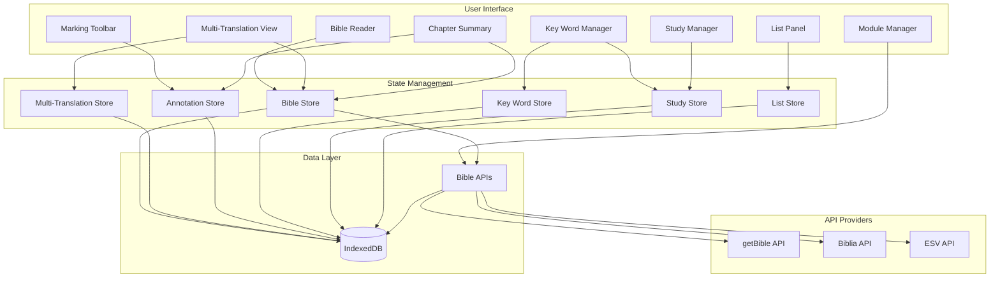

# Bible Study App - Project Plan

## Current State Summary

The app already has a solid foundation:

- **Bible Reading**: Chapter/verse navigation with API-based translations (getBible, Biblia, ESV)
- **API Integration**: Multiple Bible API providers supported (getBible free tier, Biblia for NASB/ESV/NIV/NKJV, ESV API)
- **Caching**: IndexedDB caching for offline reading of previously fetched chapters
- **Marking System**: Complete highlighting, text color, underline, and symbol annotations
- **Section Headings & Chapter Titles**: User-created headings before verses
- **Notes**: Markdown-supported notes attached to verses
- **Smart Suggestions**: Previously-used markings suggested for repeated words
- **Persistence**: IndexedDB via Dexie for all user data

---

## Phase 1: Bible API Integration (Completed)

### API Implementation

The app now supports multiple Bible API providers:

1. **getBible API** (Primary, Free):

   - No API key required
   - Many translations available (KJV, ASV, WEB, etc.)
   - Always enabled by default
   - CORS-friendly for web apps

2. **Biblia API** (by Faithlife/Logos):

   - Has both **NASB** and **ESV** available
   - Also provides NIV, NKJV, and other translations
   - Free tier: 5,000 calls/day (sufficient for personal use)
   - Well-documented REST API
   - Requires API key configuration

3. **ESV API** (Crossway):

   - ESV-only translation
   - Generous limits for personal use
   - Requires API key configuration
   - Alternative to Biblia for ESV access

### ESV API Compliance Guidelines

**CRITICAL**: The following guidelines must be followed when using the ESV API:

1. **Copyright Citation**: Must be included as outlined in ESV API documentation
2. **Noncommercial Use Only**: Use must be strictly noncommercial
3. **Query Limits**:

   - Up to 500 verses per query, or half a book, whichever is less (excepting single-chapter books)
   - Maximum 5,000 queries per day
   - Maximum 1,000 requests per hour
   - Maximum 60 requests per minute
   - If limits are exceeded, the application will be throttled

4. **Local Storage Limits**:

   - May not locally store more than 500 consecutive verses
   - May not store more than one-half of any book of the Bible (whichever is less)

5. **Display Limits**:

   - May not display more than 500 consecutive verses or one-half of any book (whichever is less) on any page

6. **Redistribution**:

   - Text may be redistributed (e.g., via email or RSS feed)
   - May distribute up to 500 verses
   - Verses quoted must not amount to 50% of a complete book
   - Verses must not make up 50% or more of the total text of the work in which they are quoted

**Implementation Requirements**:

- Implement rate limiting in ESV API client (60/min, 1000/hour, 5000/day)
- Add verse count validation before fetching (max 500 verses per query)
- Ensure copyright citation is displayed when using ESV text
- Add checks to prevent storing/displaying more than allowed verses
- Cache management must respect storage limits

### Implementation (Completed)

- ✅ Created [`src/lib/bible-api/`](src/lib/bible-api/) module with provider abstraction
- ✅ Support multiple providers (getBible, Biblia, ESV API)
- ✅ Cache fetched chapters in IndexedDB for offline reading
- ✅ API key configuration in Module Manager (stored locally in IndexedDB)
- ⚠️ **ESV API compliance checks** (rate limiting, verse count validation, copyright display) - Still needed

Key files:

- [`src/lib/bible-api/index.ts`](src/lib/bible-api/index.ts) - Provider abstraction and chapter fetching
- [`src/lib/bible-api/getbible.ts`](src/lib/bible-api/getbible.ts) - getBible API client
- [`src/lib/bible-api/biblia.ts`](src/lib/bible-api/biblia.ts) - Biblia API client
- [`src/lib/bible-api/esv.ts`](src/lib/bible-api/esv.ts) - ESV API client
- [`src/lib/db.ts`](src/lib/db.ts) - API config storage in preferences
- [`src/components/MarkingToolbar/ModuleManager.tsx`](src/components/MarkingToolbar/ModuleManager.tsx) - API translation selector and configuration

---

## Phase 2: Key Word Marking & Tracking

The core Precept feature - mark a word/phrase once, track all occurrences consistently.

### Data Model

Add to [`src/types/annotation.ts`](src/types/annotation.ts):

```typescript
interface KeyWordDefinition {
  id: string;
  word: string;           // The word/phrase (e.g., "God", "LORD", "love")
  variants: string[];     // Alternative forms (e.g., "God's", "Lord")
  symbol?: SymbolKey;     // Associated symbol (triangle for God)
  color?: HighlightColor; // Associated color
  description?: string;   // User notes about this key word
  category?: string;      // Grouping (e.g., "Identity", "Themes")
}
```

### Features

- **Key Word Manager**: UI to define and manage key words
- **Auto-detection**: When selecting text, suggest existing key word definitions
- **Find All Occurrences**: Show all instances of a key word in current book/chapter
- **Consistent Marking**: One-click to apply defined style to new occurrences
- **Key Word Legend**: Show all defined key words for quick reference

### Files to Create

- `src/stores/keyWordStore.ts` - Key word state management
- `src/components/KeyWords/KeyWordManager.tsx` - Define/edit key words
- `src/components/KeyWords/KeyWordFinder.tsx` - Find occurrences
- `src/components/KeyWords/KeyWordLegend.tsx` - Visual legend

---

## Phase 3: Multi-Translation View & Study System

Enhanced Bible reading with parallel translations, cross-translation keyword highlighting, study scoping, and the ability to clear book highlights for fresh study.

### Multi-Translation View

Display up to 3 translations side-by-side with synchronized scrolling.

**Data Model**:

```typescript
interface MultiTranslationView {
  id: string;                    // 'active' for singleton
  translationIds: string[];      // Up to 3 translation IDs (e.g., ['ESV', 'NASB', 'KJV'])
  primaryTranslationId: string;  // Main translation (for annotations/moduleId)
  syncScrolling: boolean;        // Enable/disable synchronized scrolling
}
```

**Features**:

- **Translation Selector**: Choose up to 3 translations to display
- **Side-by-Side Layout**: Vertical or horizontal layout options
- **Synchronized Scrolling**: Scroll one translation, others scroll to same chapter/verse
- **Shared Navigation**: Chapter navigation affects all visible translations
- **Primary Translation**: One translation is primary (for creating annotations/highlights)

**Implementation**:

- Store active translations in `bibleStore` or new `multiTranslationStore`
- Update `ChapterView` to render multiple `VerseText` components (one per translation)
- Use `IntersectionObserver` or scroll event handlers for synchronization
- Optionally: use a virtual scroll solution for performance with large chapters

**Files to Create/Update**:

- `src/stores/multiTranslationStore.ts` - Multi-translation state management
- `src/components/BibleReader/MultiTranslationView.tsx` - Main multi-translation component
- `src/components/BibleReader/TranslationSelector.tsx` - UI to select active translations
- `src/components/BibleReader/ChapterView.tsx` - Update to support multi-translation mode
- `src/lib/db.ts` - Add `multiTranslationView` table (or store in preferences)

### Cross-Translation Keyword Highlighting

Keywords defined in one translation are automatically highlighted in all visible translations.

**Features**:

- **Automatic Matching**: When a keyword is defined, find and highlight it in all loaded translations
- **Word Matching**: Use existing `matchesPreset()` function per translation
- **Visual Consistency**: Same color/symbol across all translations for the same keyword
- **Performance**: Cache matches per translation to avoid re-scanning on scroll

**Implementation**:

- When keywords are active, scan all visible translation texts on load/scroll
- Apply highlighting using existing annotation system (but per-translation)
- Store cross-translation matches in memory (not persisted - computed on demand)
- Optionally: pre-compute matches when translations are first loaded

**Files to Update**:

- `src/components/BibleReader/VerseText.tsx` - Support keyword highlighting from other translations
- `src/components/KeyWords/KeyWordManager.tsx` - Trigger re-highlighting when keywords change
- `src/stores/annotationStore.ts` - Add cross-translation keyword matching logic

### Study System

Introduce the concept of a "study" where keywords can be global (like "Jesus") or scoped to a particular book.

**Data Model**:

```typescript
interface Study {
  id: string;
  name: string;                  // e.g., "John - Character Study"
  book?: string;                 // Optional: scope to book (e.g., "John")
  isActive: boolean;             // Currently active study
  createdAt: Date;
  updatedAt: Date;
}

// Update MarkingPreset to include study scope
interface MarkingPreset {
  // ... existing fields ...
  studyId?: string;              // Optional: link to study (if null, global)
  bookScope?: string;            // Optional: book scope (if null, applies to all books)
}
```

**Features**:

- **Study Manager**: Create/edit/delete studies
- **Active Study**: One study can be active at a time
- **Global Keywords**: Keywords without `studyId` apply to all studies
- **Book-Scoped Keywords**: Keywords with `bookScope` only apply to that book
- **Study-Scoped Keywords**: Keywords with `studyId` only visible in that study
- **Study Switching**: Change active study to see different keyword sets
- **Default Study**: Keywords without a study are always visible

**UI**:

- Study selector in NavigationBar or separate Study Manager panel
- Visual indicator of active study
- Filter keywords by active study in Key Word Manager
- Option to create new study when marking keywords in a book

**Files to Create/Update**:

- `src/types/study.ts` - Study type definitions
- `src/stores/studyStore.ts` - Study state management
- `src/components/Study/StudyManager.tsx` - Create/edit/delete studies
- `src/components/Study/StudySelector.tsx` - Active study selector
- `src/lib/db.ts` - Add `studies` table
- `src/types/keyWord.ts` - Update `MarkingPreset` to include `studyId` and `bookScope`
- `src/components/KeyWords/KeyWordManager.tsx` - Filter by active study, show study scope

### Clear Book Highlights

Ability to clear all highlights/annotations for a book to start a fresh study.

**Features**:

- **Clear Book Option**: In options menu, add "Clear Highlights for [Book Name]"
- **Confirmation Dialog**: Warn user before clearing (irreversible action)
- **Scope**: Clear all annotations (highlights, symbols, underlines) for the selected book
- **Preserve Keywords**: Do not delete keyword definitions, only their annotations
- **Preserve Other Data**: Keep notes, section headings, chapter titles (or optionally clear those too)

**Implementation**:

- Add `clearBookAnnotations(book: string, moduleId?: string)` to `db.ts`
- Query annotations by `book` and delete (optionally filtered by `moduleId`)
- Add UI in NavigationBar options menu or Settings panel
- Show confirmation dialog with book name and count of annotations to be deleted

**Files to Create/Update**:

- `src/lib/db.ts` - Add `clearBookAnnotations()` function
- `src/components/BibleReader/NavigationBar.tsx` - Add "Clear Highlights" option in menu
- `src/components/Settings/DataManagement.tsx` - Or add to settings panel if it exists

---

## Phase 4: Observation Lists

Precept method emphasizes making lists of observations about topics.

### Data Model

```typescript
interface ObservationList {
  id: string;
  title: string;          // "What I learn about God in John 1"
  scope: {
    book?: string;        // Limit to book
    chapters?: number[];  // Limit to chapters
  };
  items: ObservationItem[];
  keyWordId?: string;     // Link to a key word
  createdAt: Date;
}

interface ObservationItem {
  id: string;
  content: string;        // The observation text
  verseRef: VerseRef;     // Source verse reference
  annotationId?: string;  // Link to an annotation
}
```

### Features

- **Create List**: Start a list for a topic/key word
- **Add from Selection**: Select text, add observation to a list
- **Auto-populate**: Generate list from all marked instances of a key word
- **List View**: Sidebar/panel showing all lists
- **Export List**: Copy/print list for study notes

### Files to Create

- `src/stores/listStore.ts` - List state management
- `src/components/Lists/ListPanel.tsx` - List sidebar
- `src/components/Lists/ListEditor.tsx` - Create/edit lists
- `src/components/Lists/AddToList.tsx` - Add selection to list

---

## Phase 5: Chapter at a Glance

Summary view for quick reference of chapter/book themes and structure.

### Features

- **Chapter Summary Card**: Compact view of:
  - User's chapter title
  - Section headings with verse ranges
  - Key words marked in this chapter
  - Key observations
- **Book Overview**: Grid of all chapter summaries
- **Theme Tracking**: See where key words appear across chapters

### Files to Create

- `src/components/Summary/ChapterAtAGlance.tsx`
- `src/components/Summary/BookOverview.tsx`
- `src/components/Summary/ThemeTracker.tsx`

---

## Phase 6: Desktop App (Tauri)

Package as a native desktop app for better offline experience.

### Why Tauri over Electron

- **Smaller bundle size**: ~3MB vs ~150MB
- **Better performance**: Uses native webview
- **Rust backend**: Can add native file access, better security
- **Cross-platform**: macOS, Windows, Linux

### Implementation

- Add Tauri to the project (`pnpm add -D @tauri-apps/cli`)
- Configure for auto-updates
- Add native file export for annotations
- Implement offline-first caching
- Add system tray for quick access

---

## Phase 7: Polish & Additional Features

### ESV API Compliance Implementation (Priority)

**Status**: ✅ Completed - Rate limiting, verse validation, copyright display, and storage checks implemented

The following compliance features need to be implemented:

1. **Rate Limiting**:

   - Track requests per minute/hour/day
   - Implement request queuing when limits are approached
   - Show user-friendly messages when rate limited
   - Store rate limit state in IndexedDB to persist across sessions

2. **Verse Count Validation**:

   - Before fetching, calculate verse count for the requested passage
   - Reject requests that exceed 500 verses or half a book
   - Show error message explaining the limit

3. **Copyright Display**:

   - Always display ESV copyright when showing ESV text
   - Include in chapter view, export, and print

4. **Storage Limits**:

   - Check cached verses before storing
   - Prevent caching more than 500 consecutive verses
   - Prevent caching more than half of any book

5. **Display Limits**:

   - Ensure UI never displays more than 500 consecutive verses
   - Ensure UI never displays more than half a book
   - Chapter view already handles this (one chapter at a time)

**Files to Update**:

- `src/lib/bible-api/esv.ts` - Add rate limiting and validation
- `src/lib/bible-api/index.ts` - Add compliance checks before fetching
- `src/components/BibleReader/ChapterView.tsx` - Display copyright for ESV
- `src/lib/db.ts` - Add rate limit tracking storage (if not already present)

**Note**: The app now uses API-only approach. All Bible text is fetched from:

- getBible API (free, many translations)
- Biblia API (NASB, ESV, NIV, NKJV - requires API key)
- ESV API (ESV only - requires API key)

Local SWORD module support has been removed. All translations are fetched via APIs and cached in IndexedDB for offline reading.

### Search (Priority after core features)

- Full-text search across all loaded chapters
- Search within annotations/notes
- Key word occurrence search

### Export/Print

- Export marked chapters as PDF
- Export lists as markdown
- Print-friendly stylesheet

### Data Management

- Import/export all user data as JSON
- Backup to local file
- Optional cloud sync (future)

---

## Architecture Diagram



---

## File Structure

### Existing Files (API Integration)

```
src/
├── lib/
│   └── bible-api/
│       ├── index.ts           # Provider abstraction and chapter fetching
│       ├── getbible.ts        # getBible API client (free, no key required)
│       ├── biblia.ts          # Biblia API client (NASB, ESV, NIV, NKJV)
│       ├── esv.ts             # ESV API client (ESV only)
│       └── types.ts           # API types and interfaces
```

### New Files (To Be Created)

```
src/
├── stores/
│   ├── keyWordStore.ts        # Key word state (Phase 2)
│   ├── multiTranslationStore.ts # Multi-translation state (Phase 3)
│   ├── studyStore.ts          # Study state (Phase 3)
│   └── listStore.ts           # Observation list state (Phase 4)
├── components/
│   ├── BibleReader/
│   │   ├── MultiTranslationView.tsx # Multi-translation view (Phase 3)
│   │   └── TranslationSelector.tsx  # Translation selector (Phase 3)
│   ├── KeyWords/
│   │   ├── KeyWordManager.tsx
│   │   ├── KeyWordFinder.tsx
│   │   ├── KeyWordLegend.tsx
│   │   └── index.ts
│   ├── Study/
│   │   ├── StudyManager.tsx   # Create/edit/delete studies (Phase 3)
│   │   └── StudySelector.tsx  # Active study selector (Phase 3)
│   ├── Lists/
│   │   ├── ListPanel.tsx
│   │   ├── ListEditor.tsx
│   │   ├── AddToList.tsx
│   │   └── index.ts
│   └── Summary/
│       ├── ChapterAtAGlance.tsx
│       ├── BookOverview.tsx
│       └── ThemeTracker.tsx
└── types/
    ├── keyWord.ts             # Updated with studyId/bookScope (Phase 3)
    ├── study.ts               # Study type definitions (Phase 3)
    └── list.ts
```