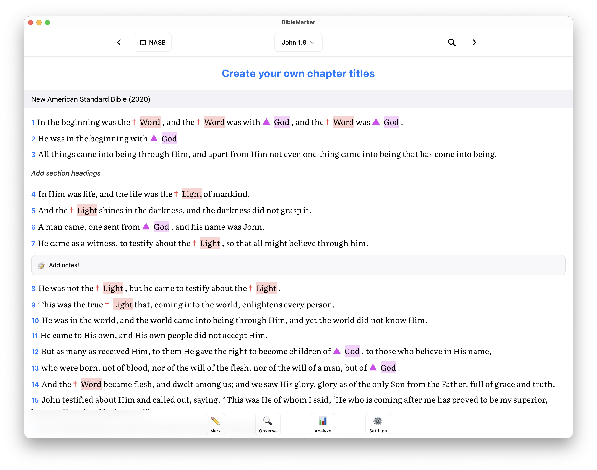

# BibleMarker

[](https://github.com/spearssoftware/BibleMarker/actions/workflows/ci.yml)
[](https://github.com/spearssoftware/BibleMarker/actions/workflows/security.yml)

Bible study built on the precepts of inductive study — observation, interpretation, and application. Mark, annotate, and analyze Scripture with powerful study tools.

**Website:** [biblemarker.app](https://biblemarker.app)



## Features

### 📖 Bible Reading
- **Multiple Translations**: NASB 2020 and NASB 1995 bundled. Additional translations available via downloadable SWORD modules or an ESV API key
- **Fully Offline**: SWORD modules are stored locally—no internet required after download
- **Multi-Translation View**: Compare up to 3 translations side-by-side with synchronized scrolling
- **Strong's Numbers**: Look up original Hebrew and Greek definitions from the text selection menu

### ✏️ Text Marking & Annotation
- **Flexible Highlighting**: Mark text with colors, underline styles, and custom symbols
- **Keyword System**: Create reusable keyword presets with automatic matching across translations
- **Case-Sensitive Keywords**: Match exact casing when needed (e.g. "LORD" vs "Lord")
- **Dismiss Auto-Matches**: Hide false positives from automatic keyword matching, with undo support
- **Smart Suggestions**: Previously used markings suggested for repeated words
- **Notes**: Add markdown-supported notes to any verse
- **Section Headings & Chapter Titles**: Create custom structure and organization

### 🔍 Inductive Bible Study Tools
- **Observation Tools**:
  - Track places, people, and times—with optional book scope
  - Identify contrasts and conclusions
  - Mark themes throughout passages
  - 5 W's and H (Who, What, When, Where, Why, How)
- **Interpretation Worksheet**: Explore what the text means
- **Application Worksheet**: Record personal applications
- **Lists**: Create custom lists to track any concept
- **Interactive Maps**: View places on an OpenFreeMap map with English labels

### 📚 Study Management
- **Study System**: Organize keywords and markings by study
- **Book-Scoped Keywords**: Limit keywords to specific books for focused study
- **Book-Scoped People & Places**: Scope observation entries to specific books
- **Clear Book Highlights**: Start fresh on any book while preserving your data structure

### 💾 Data Management
- **Automatic Backups**: Configurable auto-backup system with retention policies
- **Import/Export**: Full backup and restore capabilities
- **Study Export**: Export formatted study notes with all observations and applications
- **Local Storage**: All data stored locally in SQLite—no cloud required
- **iCloud Sync**: Optionally sync study data between macOS and iOS via iCloud

### ⚡ User Experience
- **Keyboard Shortcuts**: Navigate efficiently with arrow keys, J/K navigation, and toolbar shortcuts
- **Dark/Light Themes**: Choose dark, light, or auto (follows OS preference)
- **Scripture Fonts**: Choose from multiple scripture fonts in Appearance settings
- **Native App**: Runs natively on macOS, Windows, Linux, and iOS via Tauri

## Download & Installation

**iOS:** [Download on the App Store](https://apps.apple.com/us/app/biblemarker/id6759001361)

**Desktop:** Pre-built apps (macOS, Windows, Linux) are on [GitHub Releases](https://github.com/spearssoftware/BibleMarker/releases).

**Windows:** SmartScreen may warn for unsigned downloads. Click **More info** → **Run anyway**. For signed builds (no warning), see [Windows code signing](./docs/WINDOWS_CODE_SIGNING.md).

## Building from source

1. Clone the repository:
```bash
git clone https://github.com/spearssoftware/BibleMarker.git
cd biblemarker
```

2. Install dependencies:
```bash
corepack enable
corepack prepare pnpm@latest --activate
pnpm install
```

3. Run desktop app in development:
```bash
pnpm run tauri:dev
```

4. Build desktop app for production:
```bash
pnpm run tauri:build
```

See [docs/MAC_APP_GUIDE.md](./docs/MAC_APP_GUIDE.md) for detailed macOS-specific instructions.

## Configuration

### Bible Translations

NASB 2020 and NASB 1995 are bundled with the app. Additional translations are available as downloadable SWORD modules in **Settings → Bible → Manage Translations**.

### ESV API Key (Optional)

For the ESV translation, register for a free API key at [api.esv.org](https://api.esv.org) and add it in **Settings → Bible → API Configuration**.

## Keyboard Shortcuts

### Navigation
- `↑` / `↓` - Navigate between verses
- `J` / `K` - Navigate between verses (Vim-style)
- `←` / `→` - Previous/Next chapter
- `⌘/Ctrl + F` - Search

### Marking
- `1` - Quick color 1
- `2` - Quick color 2
- `3` - Quick color 3

View all shortcuts in **Settings → Help → Keyboard Shortcuts**

## Development

### Project Structure

```
biblemarker/
├── src/
│   ├── components/      # React components (feature-based folders)
│   ├── stores/          # Zustand state management
│   ├── lib/             # Core libraries
│   │   ├── bible-api/   # SWORD module reader + ESV API
│   │   ├── database.ts  # All CRUD and SQL operations
│   │   ├── sqlite-db.ts # SQLite driver and migrations
│   │   ├── sync.ts      # iCloud sync API
│   │   └── ...
│   └── types/           # TypeScript type definitions
├── src-tauri/           # Tauri native app code (Rust)
├── docs/                # Documentation
└── public/              # Static assets
```

### Tech Stack

- **Frontend**: React 19, TypeScript, Tailwind CSS 4
- **State Management**: Zustand
- **Database**: SQLite via @tauri-apps/plugin-sql
- **Desktop/Mobile**: Tauri 2 (Rust)
- **Build**: Vite, pnpm, Vitest, ESLint
- **Bible Data**: SWORD modules (local Z-Text format), ESV API
- **Maps**: MapLibre GL + OpenFreeMap

### Debug Logging

The app includes toggleable debug logging for development:

1. Go to **Settings → Help → Debug Logging**
2. Enable "Keyword Matching" or "Verse Text Rendering"
3. Open browser/dev console to see detailed logs

This is useful for troubleshooting keyword matching issues or rendering problems.

### Scripts

```bash
# Development
pnpm dev                  # Run web dev server
pnpm run tauri:dev        # Run Tauri desktop dev

# Building
pnpm build                # Build web app
pnpm run tauri:build      # Build desktop app

# Testing & Linting
pnpm test                 # Run tests (Vitest)
pnpm run lint             # Run ESLint

# Utilities
pnpm run generate-icons   # Generate app icons
pnpm run version:sync     # Sync version across configs
```

## License

This project is licensed under the [PolyForm Noncommercial License 1.0.0](./LICENSE).

**In Summary:**
- ✅ Free for personal use, study, research, and non-profit organizations
- ✅ Modify and share for non-commercial purposes
- ❌ Commercial use requires separate licensing

See [LICENSE](./LICENSE) file for full terms.

## Contributing

Contributions are welcome! Please feel free to submit a Pull Request.

## Support

For questions or issues:
- **Website:** [biblemarker.app](https://biblemarker.app)
- **Documentation:** [GitHub Wiki](https://github.com/spearssoftware/BibleMarker/wiki)
- Open an issue on [GitHub](https://github.com/spearssoftware/BibleMarker)
- Check the built-in help: **Settings → Help → Getting Started**

## Acknowledgments

- Bible text provided via [SWORD modules](https://crosswire.org/sword/) and [ESV API](https://api.esv.org)
- Maps powered by [OpenFreeMap](https://openfreemap.org) and [MapLibre GL](https://maplibre.org)
- Built with [Tauri](https://tauri.app) and [React](https://react.dev)

## Disclaimer

BibleMarker is independent software and is not affiliated with or endorsed by Precept Ministries International or any other organization.

---

**Made for deeper Bible study** 📖✨
