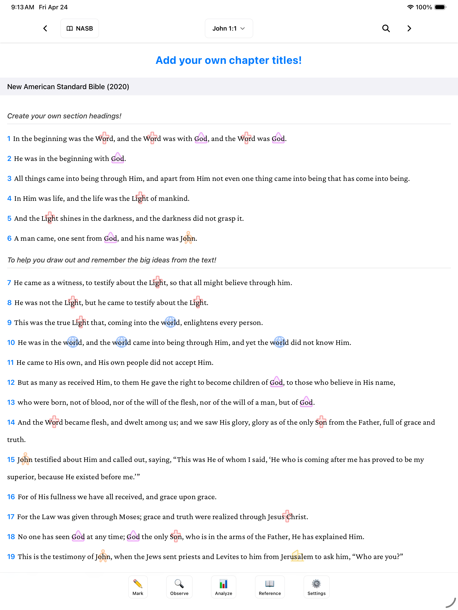
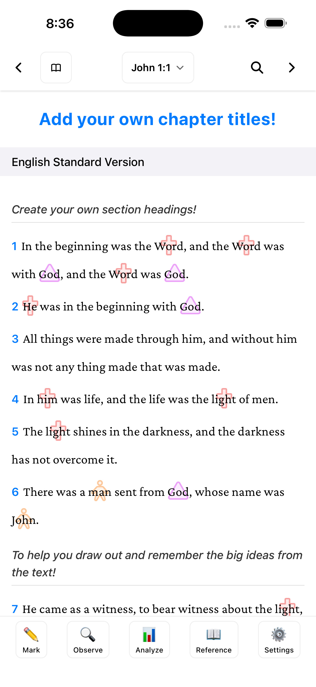
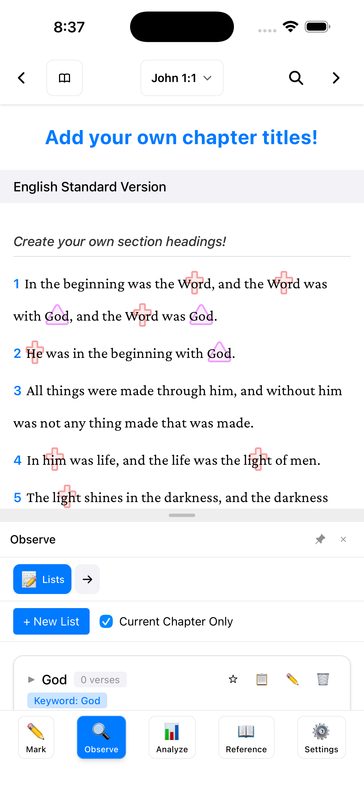
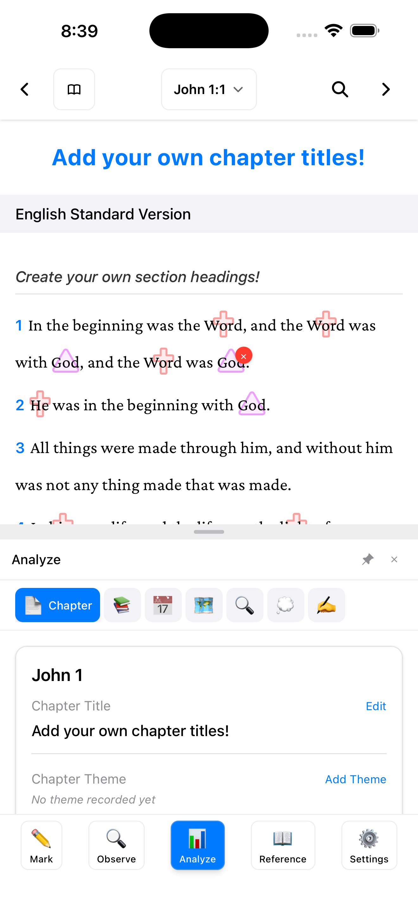
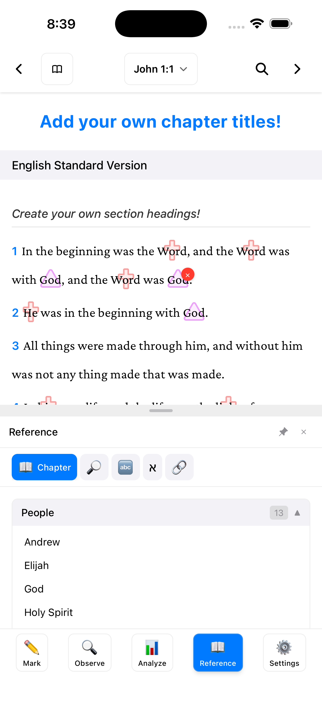

# BibleMarker

[](https://github.com/spearssoftware/BibleMarker/actions/workflows/ci.yml)
[](https://github.com/spearssoftware/BibleMarker/actions/workflows/security.yml)

BibleMarker is a local-first Bible study app built for inductive study: mark key words, capture observations, organize notes, and trace connections through Scripture without losing your place.

**Website:** [biblemarker.app](https://biblemarker.app)  
**iOS:** [Download on the App Store](https://apps.apple.com/us/app/biblemarker/id6759001361)

<p align="center">
  
</p>

## Screenshots

<table>
  <tr>
    <td></td>
    <td></td>
    <td></td>
    <td></td>
  </tr>
  <tr>
    <td><strong>Mark Scripture</strong></td>
    <td><strong>Observe Connections</strong></td>
    <td><strong>Analyze Passages</strong></td>
    <td><strong>Build References</strong></td>
  </tr>
</table>

## Features

### 📖 Read and compare Scripture
- **NASB 2020 and NASB 1995 bundled**: Start studying right away with no extra setup
- **More translations**: Download additional SWORD modules or connect an optional ESV API key
- **Offline-first reading**: Keep downloaded translations available without an internet connection
- **Multi-translation view**: Compare up to 3 translations side-by-side with synchronized scrolling
- **Strong's Numbers**: Look up original Hebrew and Greek definitions from the text selection menu

### ✏️ Mark the text as you study
- **Flexible markings**: Apply colors, underline styles, and custom symbols to words and phrases
- **Keyword presets**: Reuse markings and automatically highlight matching words across visible translations
- **Precise matching**: Use case-sensitive keywords when distinctions matter, such as `LORD` and `Lord`
- **False-positive control**: Dismiss unwanted auto-matches with undo support
- **Chapter titles and section headings**: Add your own structure to help remember the flow of a passage
- **Notes**: Add markdown-supported notes to any verse

### 🔍 Observe, analyze, and apply
- **Observation tools**: Track people, places, times, contrasts, conclusions, themes, and 5 W's/H observations
- **Custom lists**: Create lists for repeated ideas, commands, promises, questions, or anything else you want to trace
- **Chapter analysis**: Record chapter titles, themes, structure, and study notes in one place
- **Interpretation worksheet**: Work through what the text means
- **Application worksheet**: Capture personal application without mixing it into your observation notes
- **Reference view**: Review people, places, keywords, Strong's entries, and cross references while you study

### 📚 Organize focused studies
- **Study system**: Keep keywords, markings, and observations organized by study
- **Book-scoped keywords**: Limit keywords to specific books for focused studies
- **Book-scoped people and places**: Scope observation entries where they belong
- **Clear book highlights**: Start fresh on a book while preserving your reusable study structure

### 💾 Own your study data
- **Local storage**: Your study data lives locally in SQLite
- **Automatic backups**: Configure backup frequency and retention
- **Import/export**: Restore or move your full BibleMarker data when needed
- **Study export**: Export formatted study notes with observations and applications
- **iCloud sync**: Optionally sync study data between macOS and iOS through iCloud Documents

### ⚡ Built for daily use
- **Native app**: Runs on macOS, Windows, Linux, and iOS through Tauri
- **Keyboard shortcuts**: Navigate with arrow keys, J/K, chapter shortcuts, search, and marking hotkeys
- **Appearance options**: Choose dark, light, or system theme and select from multiple scripture fonts
- **Touch-friendly workflow**: Use the bottom toolbar on iPhone and iPad for Mark, Observe, Analyze, Reference, and Settings

## Download & Installation

**iOS:** [Download on the App Store](https://apps.apple.com/us/app/biblemarker/id6759001361)

**Desktop:** Pre-built apps (macOS, Windows, Linux) are on [GitHub Releases](https://github.com/spearssoftware/BibleMarker/releases).

**Windows:** SmartScreen may warn for unsigned downloads. Click **More info** → **Run anyway**. For signed builds (no warning), see [Windows code signing](./docs/WINDOWS_CODE_SIGNING.md).

## Building from source

1. Clone the repository:
```bash
git clone https://github.com/spearssoftware/BibleMarker.git
cd biblemarker
```

2. Install dependencies:
```bash
corepack enable
corepack prepare pnpm@latest --activate
pnpm install
```

3. Run desktop app in development:
```bash
pnpm run tauri:dev
```

4. Build desktop app for production:
```bash
pnpm run tauri:build
```

See [docs/MAC_APP_GUIDE.md](./docs/MAC_APP_GUIDE.md) for detailed macOS-specific instructions.

## Configuration

### Bible Translations

NASB 2020 and NASB 1995 are bundled with the app. Additional translations are available as downloadable SWORD modules in **Settings → Bible → Manage Translations**.

### ESV API Key (Optional)

For the ESV translation, register for a free API key at [api.esv.org](https://api.esv.org) and add it in **Settings → Bible → API Configuration**.

## Keyboard Shortcuts

### Navigation
- `↑` / `↓` - Navigate between verses
- `J` / `K` - Navigate between verses (Vim-style)
- `←` / `→` - Previous/Next chapter
- `⌘/Ctrl + F` - Search

### Marking
- `1` - Quick color 1
- `2` - Quick color 2
- `3` - Quick color 3

View all shortcuts in **Settings → Help → Keyboard Shortcuts**

## Development

### Project Structure

```
biblemarker/
├── src/
│   ├── components/      # React components (feature-based folders)
│   ├── stores/          # Zustand state management
│   ├── lib/             # Core libraries
│   │   ├── bible-api/   # SWORD module reader + ESV API
│   │   ├── database.ts  # All CRUD and SQL operations
│   │   ├── sqlite-db.ts # SQLite driver and migrations
│   │   ├── sync.ts      # iCloud sync API
│   │   └── ...
│   └── types/           # TypeScript type definitions
├── src-tauri/           # Tauri native app code (Rust)
├── docs/                # Documentation
└── public/              # Static assets
```

### Tech Stack

- **Frontend**: React 19, TypeScript, Tailwind CSS 4
- **State Management**: Zustand
- **Database**: SQLite via @tauri-apps/plugin-sql
- **Desktop/Mobile**: Tauri 2 (Rust)
- **Build**: Vite, pnpm, Vitest, ESLint
- **Bible Data**: SWORD modules (local Z-Text format), ESV API
- **Maps**: MapLibre GL + OpenFreeMap

### Debug Logging

The app includes toggleable debug logging for development:

1. Go to **Settings → Help → Debug Logging**
2. Enable "Keyword Matching" or "Verse Text Rendering"
3. Open browser/dev console to see detailed logs

This is useful for troubleshooting keyword matching issues or rendering problems.

### Scripts

```bash
# Development
pnpm dev                  # Run web dev server
pnpm run tauri:dev        # Run Tauri desktop dev

# Building
pnpm build                # Build web app
pnpm run tauri:build      # Build desktop app

# Testing & Linting
pnpm test                 # Run tests (Vitest)
pnpm run lint             # Run ESLint

# Utilities
pnpm run generate-icons   # Generate app icons
pnpm run version:sync     # Sync version across configs
```

## License

BibleMarker is licensed under the [GNU Affero General Public License v3.0 or later](./LICENSE) (AGPL-3.0-or-later).

**In summary:**
- ✅ Free to use, modify, and self-host — for individuals, churches, ministries, and organizations
- ✅ You may distribute modified versions, **provided you release your source code under the same license**
- ✅ Commercial use is permitted under the same terms
- 🤝 If you'd like to ship BibleMarker as part of a paid product, hosted offering, or curriculum without those copyleft requirements, [contact us](mailto:biblemarker@spearssoftware.com) — we're happy to discuss commercial licensing

See [LICENSE](./LICENSE) for full terms.

## Contributing

Contributions are welcome. Before your first pull request can be merged, you'll be asked to sign our [Contributor License Agreement](./CLA.md) — a one-click process via the CLA Assistant bot. See [CONTRIBUTING.md](./CONTRIBUTING.md) for details.

## Support

For questions or issues:
- **Website:** [biblemarker.app](https://biblemarker.app)
- **Documentation:** [GitHub Wiki](https://github.com/spearssoftware/BibleMarker/wiki)
- Open an issue on [GitHub](https://github.com/spearssoftware/BibleMarker)
- Check the built-in help: **Settings → Help → Getting Started**

## Acknowledgments

- Bible text provided via [SWORD modules](https://crosswire.org/sword/) and [ESV API](https://api.esv.org)
- Maps powered by [OpenFreeMap](https://openfreemap.org) and [MapLibre GL](https://maplibre.org)
- Built with [Tauri](https://tauri.app) and [React](https://react.dev)

## Disclaimer

BibleMarker is independent software and is not affiliated with or endorsed by Precept Ministries International or any other organization.

---

**Made for deeper Bible study** 📖✨
