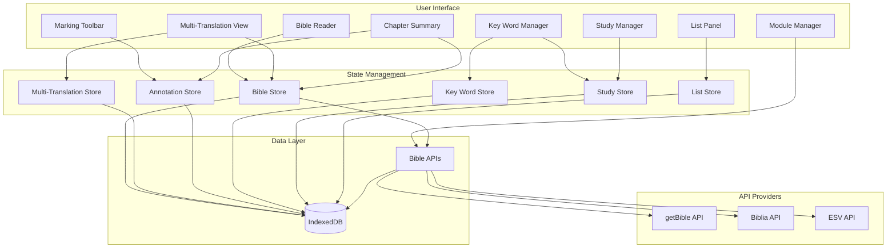

# Bible Study App - Project Plan

## Current State Summary

The app already has a solid foundation:

- **Bible Reading**: Chapter/verse navigation with API-based translations (getBible, Biblia, ESV)
- **API Integration**: Multiple Bible API providers supported (getBible free tier, Biblia for NASB/ESV/NIV/NKJV, ESV API)
- **Caching**: IndexedDB caching for offline reading of previously fetched chapters
- **Marking System**: Complete highlighting, text color, underline, and symbol annotations
- **Section Headings & Chapter Titles**: User-created headings before verses
- **Notes**: Markdown-supported notes attached to verses
- **Smart Suggestions**: Previously-used markings suggested for repeated words
- **Persistence**: IndexedDB via Dexie for all user data
- **Multi-Translation View**: ✅ Side-by-side view of up to 3 translations with synchronized scrolling
- **Study System**: ✅ Create and manage studies with book-scoped keywords
- **Clear Book Highlights**: ✅ Clear all annotations for a book to start fresh
- **Keyboard Shortcuts**: ✅ Navigation (arrow keys, J/K) and toolbar shortcuts (1-6)
- **Help & Documentation**: ✅ Help tab in Settings with Getting Started, Keyboard Shortcuts, and About sections
- **Settings Panel**: ✅ Full settings UI with tabs (Appearance, Bible, Studies, Data, Help)
- **Light/Dark Theme**: ✅ Theme support with Light, Dark, and Auto (follow OS) modes
- **Loading States**: ✅ Loading indicators for all async operations
- **UI Polish**: ✅ Enhanced overlay blur effects for better visual focus

---

## Phase 1: Bible API Integration (Completed)

### API Implementation

The app now supports multiple Bible API providers:

1. **getBible API** (Primary, Free):

   - No API key required
   - Many translations available (KJV, ASV, WEB, etc.)
   - Always enabled by default
   - CORS-friendly for web apps

2. **Biblia API** (by Faithlife/Logos):

   - Has both **NASB** and **ESV** available
   - Also provides NIV, NKJV, and other translations
   - Free tier: 5,000 calls/day (sufficient for personal use)
   - Well-documented REST API
   - Requires API key configuration

3. **ESV API** (Crossway):

   - ESV-only translation
   - Generous limits for personal use
   - Requires API key configuration
   - Alternative to Biblia for ESV access

### ESV API Compliance Guidelines

**CRITICAL**: The following guidelines must be followed when using the ESV API:

1. **Copyright Citation**: Must be included as outlined in ESV API documentation
2. **Noncommercial Use Only**: Use must be strictly noncommercial
3. **Query Limits**:

   - Up to 500 verses per query, or half a book, whichever is less (excepting single-chapter books)
   - Maximum 5,000 queries per day
   - Maximum 1,000 requests per hour
   - Maximum 60 requests per minute
   - If limits are exceeded, the application will be throttled

4. **Local Storage Limits**:

   - May not locally store more than 500 consecutive verses
   - May not store more than one-half of any book of the Bible (whichever is less)

5. **Display Limits**:

   - May not display more than 500 consecutive verses or one-half of any book (whichever is less) on any page

6. **Redistribution**:

   - Text may be redistributed (e.g., via email or RSS feed)
   - May distribute up to 500 verses
   - Verses quoted must not amount to 50% of a complete book
   - Verses must not make up 50% or more of the total text of the work in which they are quoted

**Implementation Requirements**:

- Implement rate limiting in ESV API client (60/min, 1000/hour, 5000/day)
- Add verse count validation before fetching (max 500 verses per query)
- Ensure copyright citation is displayed when using ESV text
- Add checks to prevent storing/displaying more than allowed verses
- Cache management must respect storage limits

### Implementation (Completed)

- ✅ Created [`src/lib/bible-api/`](src/lib/bible-api/) module with provider abstraction
- ✅ Support multiple providers (getBible, Biblia, ESV API)
- ✅ Cache fetched chapters in IndexedDB for offline reading
- ✅ API key configuration in Module Manager (stored locally in IndexedDB)
- ✅ **ESV API compliance checks**:
  - ✅ Rate limiting (60/min, 1000/hr, 5000/day) - implemented with IndexedDB tracking
  - ✅ Verse count validation (500 verses or half book limit) - validated before fetching
  - ⚠️ Copyright display - returned in API response but not yet displayed in UI
  - ⚠️ Storage limits - caching doesn't check ESV storage limits before storing
  - ✅ Display limits - naturally enforced (one chapter at a time)

Key files:

- [`src/lib/bible-api/index.ts`](src/lib/bible-api/index.ts) - Provider abstraction and chapter fetching
- [`src/lib/bible-api/getbible.ts`](src/lib/bible-api/getbible.ts) - getBible API client
- [`src/lib/bible-api/biblia.ts`](src/lib/bible-api/biblia.ts) - Biblia API client
- [`src/lib/bible-api/esv.ts`](src/lib/bible-api/esv.ts) - ESV API client
- [`src/lib/db.ts`](src/lib/db.ts) - API config storage in preferences
- [`src/components/MarkingToolbar/ModuleManager.tsx`](src/components/MarkingToolbar/ModuleManager.tsx) - API translation selector and configuration

---

## Phase 2: Key Word Marking & Tracking

The core Precept feature - mark a word/phrase once, track all occurrences consistently.

### Data Model

Add to [`src/types/annotation.ts`](src/types/annotation.ts):

```typescript
interface KeyWordDefinition {
  id: string;
  word: string;           // The word/phrase (e.g., "God", "LORD", "love")
  variants: string[];     // Alternative forms (e.g., "God's", "Lord")
  symbol?: SymbolKey;     // Associated symbol (triangle for God)
  color?: HighlightColor; // Associated color
  description?: string;   // User notes about this key word
  category?: string;      // Grouping (e.g., "Identity", "Themes")
}
```

### Features

- **Key Word Manager**: UI to define and manage key words
- **Auto-detection**: When selecting text, suggest existing key word definitions
- **Find All Occurrences**: Show all instances of a key word in current book/chapter
- **Consistent Marking**: One-click to apply defined style to new occurrences
- **Key Word Legend**: Show all defined key words for quick reference

### Files to Create

- `src/stores/keyWordStore.ts` - Key word state management
- `src/components/KeyWords/KeyWordManager.tsx` - Define/edit key words
- `src/components/KeyWords/KeyWordFinder.tsx` - Find occurrences
- `src/components/KeyWords/KeyWordLegend.tsx` - Visual legend

---

## Phase 3: Multi-Translation View & Study System ✅ COMPLETE

Enhanced Bible reading with parallel translations, cross-translation keyword highlighting, study scoping, and the ability to clear book highlights for fresh study.

**Status**: All Phase 3 features have been implemented and are working.

### Multi-Translation View

Display up to 3 translations side-by-side with synchronized scrolling.

**Data Model**:

```typescript
interface MultiTranslationView {
  id: string;                    // 'active' for singleton
  translationIds: string[];      // Up to 3 translation IDs (e.g., ['ESV', 'NASB', 'KJV'])
  primaryTranslationId: string;  // Main translation (for annotations/moduleId)
  syncScrolling: boolean;        // Enable/disable synchronized scrolling
}
```

**Features**:

- **Translation Selector**: Choose up to 3 translations to display
- **Side-by-Side Layout**: Vertical or horizontal layout options
- **Synchronized Scrolling**: Scroll one translation, others scroll to same chapter/verse
- **Shared Navigation**: Chapter navigation affects all visible translations
- **Primary Translation**: One translation is primary (for creating annotations/highlights)

**Implementation** (✅ Completed):

- ✅ Created `multiTranslationStore` for state management
- ✅ Created `MultiTranslationView.tsx` component with side-by-side layout
- ✅ Created `TranslationSelector.tsx` for selecting up to 3 translations
- ✅ Added `multiTranslationViews` table to database
- ✅ Fixed double scrollbar issue (conditional overflow on main element)
- ✅ Implemented sequential loading to prevent network overload
- ✅ Improved error handling for missing translations
- ✅ Synchronized scrolling implemented (toggle-able)
- ✅ Fixed verse number menu/note creation to work from all translation columns (not just leftmost)
- ✅ Fixed menu overlay to appear on the clicked verse number (not always leftmost translation)

**Files Created/Updated**:

- ✅ `src/stores/multiTranslationStore.ts` - Multi-translation state management
- ✅ `src/components/BibleReader/MultiTranslationView.tsx` - Main multi-translation component
- ✅ `src/components/BibleReader/TranslationSelector.tsx` - UI to select active translations
- ✅ `src/types/multiTranslation.ts` - Type definitions
- ✅ `src/lib/db.ts` - Added `multiTranslationViews` table
- ✅ `src/App.tsx` - Updated to conditionally handle overflow for multi-translation mode

### Cross-Translation Keyword Highlighting

Keywords defined in one translation are automatically highlighted in all visible translations.

**Features**:

- **Automatic Matching**: When a keyword is defined, find and highlight it in all loaded translations
- **Word Matching**: Use existing `matchesPreset()` function per translation
- **Visual Consistency**: Same color/symbol across all translations for the same keyword
- **Performance**: Cache matches per translation to avoid re-scanning on scroll

**Implementation**:

- When keywords are active, scan all visible translation texts on load/scroll
- Apply highlighting using existing annotation system (but per-translation)
- Store cross-translation matches in memory (not persisted - computed on demand)
- Optionally: pre-compute matches when translations are first loaded

**Files Updated**:

- ✅ `src/components/BibleReader/VerseText.tsx` - Supports keyword highlighting across translations
- ✅ `src/components/BibleReader/MultiTranslationView.tsx` - Handles cross-translation keyword matching
- ✅ `src/lib/keywordMatching.ts` - Keyword matching logic works per translation

**TODO - Pronoun Marking Rework**:

- ⚠️ **Current Issue**: When manually marking pronouns (e.g., "He" as Jesus), the annotation only appears in the translation where it was marked. It does not carry across to other translations like normal keywords do.
- **Desired Behavior**: Manually marked pronouns should also appear highlighted across all translations, similar to how normal keywords work.
- **Potential Solutions**:
  - Add pronouns as variants to the keyword when manually marked (but this would cause all instances to highlight, not just the marked one)
  - Create a separate system for "contextual pronouns" that are marked once but appear across translations
  - Use a different annotation type that can be matched across translations based on verse position/context
- **Status**: Needs rework - current `moduleScope` approach limits pronouns to single translation only

### Study System

Introduce the concept of a "study" where keywords can be global (like "Jesus") or scoped to a particular book.

**Data Model**:

```typescript
interface Study {
  id: string;
  name: string;                  // e.g., "John - Character Study"
  book?: string;                 // Optional: scope to book (e.g., "John")
  isActive: boolean;             // Currently active study
  createdAt: Date;
  updatedAt: Date;
}

// Update MarkingPreset to include study scope
interface MarkingPreset {
  // ... existing fields ...
  studyId?: string;              // Optional: link to study (if null, global)
  bookScope?: string;            // Optional: book scope (if null, applies to all books)
}
```

**Features**:

- **Study Manager**: Create/edit/delete studies
- **Active Study**: One study can be active at a time
- **Global Keywords**: Keywords without `studyId` apply to all studies
- **Book-Scoped Keywords**: Keywords with `bookScope` only apply to that book
- **Study-Scoped Keywords**: Keywords with `studyId` only visible in that study
- **Study Switching**: Change active study to see different keyword sets
- **Default Study**: Keywords without a study are always visible

**Implementation** (✅ Completed):

- ✅ Created `Study` type definition
- ✅ Created `studyStore` for state management
- ✅ Created `StudyManager` component for creating/editing/deleting studies
- ✅ Created `StudySelector` component for selecting active study
- ✅ Added `studies` table to database
- ✅ Updated `MarkingPreset` type to include `studyId` and `bookScope` fields
- ✅ Study scoping logic implemented in keyword matching

**UI**:

- ✅ Study Manager panel for creating/editing/deleting studies
- ✅ Study Selector component for choosing active study
- ✅ Visual indicator of active study
- ✅ Filter keywords by active study in Key Word Manager
- ✅ Study scope displayed in keyword cards
- ✅ Study selection in keyword editor

**Files Created/Updated**:

- ✅ `src/types/study.ts` - Study type definitions
- ✅ `src/stores/studyStore.ts` - Study state management
- ✅ `src/components/Study/StudyManager.tsx` - Create/edit/delete studies
- ✅ `src/components/Study/StudySelector.tsx` - Active study selector
- ✅ `src/lib/db.ts` - Added `studies` table
- ✅ `src/types/keyWord.ts` - Updated `MarkingPreset` to include `studyId` and `bookScope`
- ✅ `src/components/KeyWords/KeyWordManager.tsx` - Filter by active study, show study scope, study selection in editor
- ✅ `src/components/BibleReader/VerseText.tsx` - Filter keywords by active study when highlighting

### Clear Book Highlights

Ability to clear all highlights/annotations for a book to start a fresh study.

**Features**:

- **Clear Book Option**: In options menu, add "Clear Highlights for [Book Name]"
- **Confirmation Dialog**: Warn user before clearing (irreversible action)
- **Scope**: Clear all annotations (highlights, symbols, underlines) for the selected book
- **Preserve Keywords**: Do not delete keyword definitions, only their annotations
- **Preserve Other Data**: Keep notes, section headings, chapter titles (or optionally clear those too)

**Implementation** (✅ Completed):

- ✅ Added `clearBookAnnotations(book: string, moduleId?: string)` to `db.ts`
- ✅ Queries annotations by `book` and deletes (optionally filtered by `moduleId`)
- ✅ UI added to Toolbar's "More" menu (⚙️ button)
- ✅ Shows confirmation dialog with book name
- ✅ Returns count of deleted annotations and shows success message
- ✅ Triggers annotation reload after clearing

**Files Created/Updated**:

- ✅ `src/lib/db.ts` - Added `clearBookAnnotations()` function
- ✅ `src/components/MarkingToolbar/Toolbar.tsx` - Added "Clear Highlights" option in "More" menu

---

## Phase 4: Observation Lists ✅

Precept method emphasizes making lists of observations about topics.

### Data Model

```typescript
interface ObservationList {
  id: string;
  title: string;          // "What I learn about God in John 1"
  scope?: {
    book?: string;        // Limit to book
    chapters?: number[];  // Limit to chapters
  };
  items: ObservationItem[];
  keyWordId: string;      // Required: link to a key word (MarkingPreset)
  studyId?: string;       // Optional: link to a study
  createdAt: Date;
  updatedAt: Date;
}

interface ObservationItem {
  id: string;
  content: string;        // The observation text
  verseRef: VerseRef;     // Source verse reference
  annotationId?: string;  // Optional link to an annotation
  createdAt: Date;
  updatedAt: Date;
}
```

### Features ✅

- ✅ **Create List**: Start a list for a topic/key word (keyword required)
- ✅ **Add from Selection**: Select text, add observation to a list
- ✅ **Auto-populate**: Generate list from all instances of a keyword in cached Bible text (not just manually tagged)
- ✅ **List View**: Sidebar/panel showing all lists, grouped by verse
- ✅ **Edit Observations**: Edit or delete individual observation items
- ✅ **Sort by Verse**: Lists automatically sorted by canonical Bible order (book → chapter → verse)
- ✅ **Default to Recent**: Most recently used list is pre-selected when adding observations
- ✅ **Export List**: Copy/print list for study notes (formatted with verse references)

### Implementation Details

- **Keyword-Centric**: Lists are intrinsically tied to a specific keyword (required `keyWordId`)
- **Verse Grouping**: Observations are grouped by verse, with multiple observations per verse as bullet points
- **Text Cleaning**: Symbol markers are automatically stripped from selected text
- **Smart Matching**: Auto-populate uses the same keyword matching logic as visual highlighting (handles variants, scoping, multi-word phrases)

### Files Created

- ✅ `src/stores/listStore.ts` - List state management with persistence
- ✅ `src/components/Lists/ListPanel.tsx` - List sidebar with verse grouping
- ✅ `src/components/Lists/ListEditor.tsx` - Create/edit lists
- ✅ `src/components/Lists/AddToList.tsx` - Add selection to list dialog
- ✅ `src/lib/textUtils.ts` - Utility for stripping symbol markers from text
- ✅ `src/types/list.ts` - TypeScript interfaces for observation lists

---

## Phase 5: Chapter at a Glance ✅ COMPLETE

Summary view for quick reference of chapter/book themes and structure.

### Features ✅

- ✅ **Chapter Summary Card**: Compact view of:
  - User's chapter title
  - Section headings with verse ranges
  - Key words marked in this chapter
  - Key observations
- ✅ **Book Overview**: Grid of all chapter summaries
- ✅ **Theme Tracking**: See where key words appear across chapters
- ✅ **Study Tools Panel**: Unified tabbed interface combining:
  - Overview tab (Book Overview)
  - Chapter tab (Chapter at a Glance)
  - Theme tab (Theme Tracker)
  - Observation tab (Observation Lists)
- ✅ **Navigation**: Clicking chapters/observations switches tabs and navigates

### Implementation (✅ Completed)

- ✅ Created `ChapterAtAGlance.tsx` - Shows chapter summary with title, headings, keywords, and observations
- ✅ Created `BookOverview.tsx` - Grid view of all chapters with summary data
- ✅ Created `ThemeTracker.tsx` - Visual tracking of keywords across chapters
- ✅ Created `StudyToolsPanel.tsx` - Unified panel with tabbed interface
- ✅ Added Study Tools as top-level toolbar button (📚 icon)
- ✅ ThemeTracker integrates with keyword matching to show all keyword occurrences
- ✅ ThemeTracker displays symbols and colors matching Key Word Manager
- ✅ Navigation: Clicking chapter in Overview switches to Chapter tab
- ✅ Navigation: Clicking observation in Chapter switches to Observation tab
- ✅ Renamed Lists tab to "Observation"
- ✅ Renamed "Add to List" button to "Add Observation" in selection bar

### Files Created/Updated

- ✅ `src/components/Summary/ChapterAtAGlance.tsx` - Chapter summary component
- ✅ `src/components/Summary/BookOverview.tsx` - Book overview grid component
- ✅ `src/components/Summary/ThemeTracker.tsx` - Keyword theme tracking component
- ✅ `src/components/Summary/StudyToolsPanel.tsx` - Unified study tools panel
- ✅ `src/components/Summary/index.ts` - Summary components exports
- ✅ `src/components/MarkingToolbar/Toolbar.tsx` - Added Study Tools button, integrated StudyToolsPanel

---

## Phase 6: Desktop App (Tauri)

Package as a native desktop app for better offline experience.

**Status**: Not yet started - planned for post-MVP.

### Why Tauri over Electron

- **Smaller bundle size**: ~3MB vs ~150MB
- **Better performance**: Uses native webview
- **Rust backend**: Can add native file access, better security
- **Cross-platform**: macOS, Windows, Linux

### Implementation

- Add Tauri to the project (`pnpm add -D @tauri-apps/cli`)
- Configure for auto-updates
- Add native file export for annotations
- Implement offline-first caching
- Add system tray for quick access

---

## Phase 7: Polish & Additional Features

## Version 1.0 Readiness Checklist

Essential features and polish needed for a production-ready v1 release:

### Critical Features (Must Have for v1)

1. ✅ **Backup/Restore** - ✅ COMPLETE (Phase 7)
2. ✅ **Search** - ✅ COMPLETE (Phase 7)
3. ✅ **Dedicated Settings Panel** - ✅ COMPLETE - Full settings UI with tabs (Appearance, Bible, Studies, Data, Help)
4. ✅ **Error Display UI** - ✅ COMPLETE - Global error display component showing errors from Bible store
5. ✅ **Loading States** - ✅ COMPLETE - All async operations show loading indicators

### User Experience (Should Have for v1)

7. ✅ **Light/Dark Theme** - ✅ COMPLETE - Theme support following OS settings

   - ✅ **Theme Options**: Light, Dark, or Auto (follow OS)
   - ✅ **OS Integration**: Uses `prefers-color-scheme` media query for auto mode
   - ✅ **Theme Toggle**: Settings UI to switch between themes
   - ✅ **Persistence**: Theme preference saved in IndexedDB
   - ✅ **Implementation**:
     - ✅ Light theme color palette in CSS variables
     - ✅ CSS variables and Tailwind dark mode classes for theme switching
     - ✅ OS theme changes detected and applied in auto mode
     - ✅ Theme class applied to root HTML element
     - ✅ All components support both themes (text colors, backgrounds, borders, etc.)
   - ✅ **Default**: Auto mode (follow OS) for new users

8. ✅ **Keyboard Shortcuts** - ✅ COMPLETE

   - ✅ Navigation: Arrow keys, J/K for next/prev chapter
   - ✅ Quick actions: Cmd/Ctrl+F for search (handled by NavigationBar)
   - ✅ Toolbar shortcuts: Number keys 1-6 for tools
   - ✅ Keyboard shortcuts help reference in Settings → Help tab

9. ✅ **Onboarding/Tutorial** - ✅ COMPLETE - First-time user guidance

   - ✅ Welcome screen explaining key features
   - ✅ Tooltips for first use of major features
   - ✅ Quick tour option

10. ✅ **Help/Documentation** - ✅ COMPLETE

   - ✅ Help tab in Settings with comprehensive documentation
   - ✅ Getting Started section with feature overview
   - ✅ Keyboard shortcuts reference
   - ⚠️ Contextual help tooltips (not yet implemented)

11. ✅ **About/Version Info** - ✅ COMPLETE - App information

    - ✅ Version number display (0.1.0)
    - ✅ Credits/attributions for all Bible API providers (getBible, Biblia, ESV, BibleGateway)
    - ✅ License information
    - ✅ Links to API documentation
    - ✅ Located in Settings → Help tab → About section

### Accessibility (Should Have for v1)

11. ✅ **ARIA Labels** - ✅ COMPLETE - Screen reader support

    - ✅ Landmark regions (nav, main) with proper labels
    - ✅ ARIA labels on navigation buttons (Previous, Next, Translation, Book, Chapter, Verse selectors)
    - ✅ ARIA labels on toolbar buttons
    - ✅ Form labels with htmlFor attributes (NoteCreator, SectionHeadingCreator, ChapterTitleCreator, ListEditor, AddToList)
    - ✅ Screen reader only (sr-only) class for hidden labels
    - ✅ ARIA expanded/haspopup for dropdown buttons
    - ✅ Modal dialogs with role="dialog" and aria-label (Search, SettingsPanel, ListPanel, StudyToolsPanel, VerseOverlay)
    - ✅ Menu components with role="menu" and role="menuitem" (VerseNumberMenu)
    - ✅ Tab interfaces with role="tablist", role="tab", role="tabpanel" (SettingsPanel)
    - ✅ Close buttons with descriptive aria-labels
    - ✅ Icon-only buttons with aria-hidden on icons and descriptive labels

13. ✅ **Keyboard Navigation** - ✅ IN PROGRESS - Full keyboard accessibility

    - ✅ Enhanced focus indicators (visible outline on focus-visible)
    - ✅ Keyboard shortcuts already implemented (arrow keys, J/K, Cmd/Ctrl+F, number keys 1-6)
    - ✅ Forms support keyboard navigation (Enter to save, Esc to cancel)
    - ⚠️ Verify tab order is logical across all components
    - ⚠️ Ensure all features accessible via keyboard (some buttons have tabIndex={-1} which may need review)

13. ⚠️ **Color Contrast** - WCAG compliance

    - ⚠️ Verify all text meets contrast requirements
    - ⚠️ High contrast mode option

### Data & Reliability (Should Have for v1)

15. ✅ **Data Validation** - ✅ COMPLETE

    - ✅ Validate data on import (backup restore with detailed validation)
    - ✅ Schema validation for IndexedDB (all save operations validated)
    - ✅ Graceful handling of malformed data (error messages with field details)
    - ✅ Created `src/lib/validation.ts` with validators for all data types
    - ✅ Integrated validation into all database save functions
    - ✅ Date sanitization (ISO strings converted to Date objects)

16. ✅ **Data Migration** - ✅ COMPLETE

    - ✅ Version tracking in database (Dexie versioning system)
    - ✅ Migration scripts for schema updates (v1-v7 with upgrade handlers)
    - ✅ Backward compatibility (deprecated tables kept for compatibility)
    - ✅ Enhanced error handling in migrations (individual record failures don't break migration)
    - ✅ Migration logging for debugging

17. ✅ **Offline Error Handling** - ✅ COMPLETE

    - ✅ Clear messages when offline (user-friendly error messages)
    - ✅ Retry mechanisms (exponential backoff for all API calls)
    - ✅ Cache status indicators (utilities for checking cache status)
    - ✅ Created `src/lib/offline.ts` with offline detection and retry utilities
    - ✅ Integrated retry logic into all Bible API providers (getBible, Biblia, ESV, BibleGateway)
    - ✅ Online/offline status watching utilities

### Mobile Experience (Should Have for v1)

17. ⚠️ **Mobile Toolbar Optimization** - Better mobile UX

    - Responsive toolbar layout
    - Touch-friendly button sizes
    - Swipe gestures for navigation

19. ⚠️ **Mobile Navigation** - Optimized for small screens

    - Collapsible navigation
    - Bottom sheet modals
    - Touch-optimized pickers

### Polish (Nice to Have for v1)

18. ✅ **Overlay Blur Effects** - ✅ COMPLETE

    - ✅ Enhanced backdrop blur (24px) for better focus on overlay content
    - ✅ Improved visual separation between overlays and background content
    - ✅ Consistent blur styling across all modal/overlay components

19. ⚠️ **Undo/Redo** - For annotations and notes

    - Undo last annotation
    - Undo/redo stack
    - Keyboard shortcuts (Cmd/Ctrl+Z)

21. ⚠️ **Performance Optimization** - Large books/chapters

    - Virtual scrolling for long chapters
    - Lazy loading of annotations
    - Debounced search

22. ⚠️ **Analytics/Error Tracking** - Optional

    - Error boundary with reporting
    - Usage analytics (privacy-respecting)
    - Performance monitoring

### ESV API Compliance Implementation (Priority)

**Status**: ✅ Complete - All ESV API compliance requirements implemented and verified.

**Implemented**:

1. ✅ **Rate Limiting**:

   - ✅ Track requests per minute/hour/day in IndexedDB (`db.esvRateLimit`)
   - ✅ Check limits before each request (`checkEsvRateLimit()`)
   - ✅ Record requests after successful calls (`recordEsvRequest()`)
   - ✅ Show user-friendly error messages when rate limited (429 status)
   - ✅ Rate limit state persists across sessions in IndexedDB

2. ✅ **Verse Count Validation**:

   - ✅ Before fetching, calculate verse count for the requested passage
   - ✅ Reject requests that exceed 500 verses or half a book (`validateEsvVerseCount()`)
   - ✅ Show error message explaining the limit
   - ✅ Applied in `getChapter()` and `getVerseRange()` methods

3. ✅ **Copyright Display**:

   - ✅ ESV copyright constant defined (`ESV_COPYRIGHT`)
   - ✅ Copyright returned in API response (`ChapterResponse.copyright`)
   - ✅ Copyright displayed in MultiTranslationView at bottom of each translation column
   - ⚠️ **TODO**: Include in export and print (if export/print functionality is added)

4. ✅ **Storage Limits**:

   - ✅ Check cached verses before storing ESV chapters
   - ✅ Prevent caching more than 500 consecutive verses
   - ✅ Prevent caching more than half of any book
   - ✅ Storage limit checks implemented in `fetchChapter()` before caching
   - ✅ Improved logic to accurately detect consecutive verse sequences across chapters
   - ✅ Console warnings when storage limits would be exceeded (for debugging)

5. ✅ **Display Limits**:

   - ✅ UI naturally enforces limits (one chapter at a time)
   - ✅ Never displays more than 500 consecutive verses
   - ✅ Never displays more than half a book

**Files Status**:

- ✅ `src/lib/bible-api/esv.ts` - Rate limiting and verse validation implemented
- ✅ `src/lib/bible-api/index.ts` - ESV client integration complete, storage limit checks implemented
- ✅ `src/lib/db.ts` - Rate limit tracking storage implemented (`esvRateLimit` table)
- ✅ `src/components/BibleReader/MultiTranslationView.tsx` - ESV copyright displayed at bottom of translation columns

**Note**: The app now uses API-only approach. All Bible text is fetched from:

- getBible API (free, many translations)
- Biblia API (NASB, ESV, NIV, NKJV - requires API key)
- ESV API (ESV only - requires API key)

Local SWORD module support has been removed. All translations are fetched via APIs and cached in IndexedDB for offline reading.

### Search (Priority for v1) ✅ COMPLETE

Essential for a complete Bible study experience.

**Features**:

- ✅ **Full-text search** across all loaded chapters
- ✅ **Search within annotations/notes** - Find notes by content
- ✅ **Search within annotations** - Find annotations by selected text
- ✅ **Verse reference search** - Search by reference (e.g., "John 3:16")
- ✅ **Search UI**: Search bar in navigation, keyboard shortcut (Cmd/Ctrl+F)

**Implementation** (✅ Completed):

- ✅ Created `src/lib/search.ts` - Search utility library with:
  - `searchBibleText()` - Full-text search across cached chapters
  - `searchNotes()` - Search notes by content
  - `searchAnnotations()` - Search annotations by selected text
  - `parseVerseReference()` - Parse verse references (e.g., "John 3:16")
  - `searchAll()` - Comprehensive search combining all types
- ✅ Created `src/components/Search/Search.tsx` - Search UI component with:
  - Search input with 300ms debouncing
  - Scope selector (All, Bible, Notes, Annotations)
  - Results display with type indicators (📖 verse, 📝 note, 🖍 annotation)
  - Keyboard navigation (↑↓ arrows, Enter to select, Esc to close)
  - Search term highlighting in results
  - Verse reference search support
- ✅ Integrated search into NavigationBar:
  - Search button in top navigation bar
  - Keyboard shortcut (Cmd/Ctrl+F) support
  - Search modal with backdrop
  - Navigation to selected results with verse scrolling
- ✅ Fixed search overlay animation positioning:
  - Custom animation that preserves `translateX(-50%)` for centering
  - Prevents overlay from appearing to the right then moving to center

**Files Created/Updated**:

- ✅ `src/lib/search.ts` - Search utility functions
- ✅ `src/components/Search/Search.tsx` - Search UI component
- ✅ `src/components/Search/index.ts` - Search component exports
- ✅ `src/components/BibleReader/NavigationBar.tsx` - Added search integration and keyboard shortcut
- ✅ `src/index.css` - Added custom search animation

### Export/Print (Post-MVP)

Users need to export their study work.

- **Export marked chapters as PDF** - Include annotations, highlights, notes
- **Export observation lists as markdown** - For sharing or printing
- **Print-friendly stylesheet** - Clean print layout
- **Export all notes** - As a document
- **Include ESV copyright** when exporting ESV text (compliance requirement)

### Data Management & Backup/Restore ✅ COMPLETE

Comprehensive backup and restore functionality to protect user data and enable data portability.

**Status**: All features implemented and working.

#### Data to Backup

All user-created data should be included in backups:

- **Settings & Preferences**:
  - API keys (Biblia, ESV API)
  - Default translation preferences
  - Multi-translation view configurations
  - User preferences (theme, layout, etc.)

- **Annotations**:
  - All highlights, symbols, underlines
  - Text colors and styles
  - Verse-level annotations

- **Keywords**:
  - All marking presets (key words)
  - Variants, colors, symbols
  - Study and book scoping

- **Studies**:
  - All study definitions
  - Active study state

- **Notes**:
  - All verse notes (markdown content)
  - Section headings
  - Chapter titles

- **Observation Lists**:
  - All lists and their items
  - Verse references and links

- **Cached Bible Text** (Optional):
  - IndexedDB cached chapters
  - Can be large, so make this optional

#### Backup Format

```typescript
interface BackupData {
  version: string;              // App version for compatibility checking
  timestamp: string;            // ISO timestamp of backup creation
  data: {
    preferences: Preferences;
    annotations: Annotation[];
    markingPresets: MarkingPreset[];
    studies: Study[];
    notes: Note[];
    sectionHeadings: SectionHeading[];
    chapterTitles: ChapterTitle[];
    observationLists: ObservationList[];
    multiTranslationViews: MultiTranslationView[];
    cachedChapters?: CachedChapter[];  // Optional
  };
}
```

#### Features

- **Export Backup**:
  - Single button to export all data as JSON file
  - **Save to cloud folder**: Use File System Access API to let user choose save location (iCloud Drive, Google Drive, etc.)
  - Files automatically sync via user's cloud service (no app-side sync needed)
  - Filename includes timestamp: `biblestudy-backup-2024-01-15-HHMMSS.json`
  - Option to include/exclude cached Bible text
  - Progress indicator for large exports
  - Fallback to browser download if File System Access API not available

- **Import/Restore Backup**:
  - **Load from cloud folder**: Use File System Access API to let user select backup file from their cloud-synced folders
  - Direct file access (no upload needed) - user selects file from iCloud Drive, Google Drive, etc.
  - Fallback to traditional file input if File System Access API not available
  - Validation of backup format and version compatibility
  - Preview of what will be restored (data counts)
  - Options:
    - **Full Restore**: Replace all existing data
    - **Merge**: Add/update data without deleting existing
    - **Selective Restore**: Choose which data types to restore
  - Confirmation dialog before restore (destructive operation)
  - Success/error feedback

- **Backup Validation**:
  - Check backup file format
  - Verify required fields
  - Warn about version mismatches
  - Validate data integrity

- **UI Location**:
  - Add "Backup & Restore" section to Settings/Preferences panel
  - Or add to Toolbar "More" menu (⚙️ button)
  - Clear labels: "Export Backup" and "Import Backup"

#### Implementation Details

- **Export Function**:
  - Query all tables from IndexedDB
  - Combine into backup format
  - Generate JSON file
  - **Use File System Access API** (if available) to let user choose save location:
    - User can select their iCloud Drive or Google Drive folder
    - File automatically syncs via their cloud service
    - Fallback to browser download if API not available
  - Filename: `biblestudy-backup-YYYY-MM-DD-HHMMSS.json`

- **Import Function**:
  - **Use File System Access API** (if available) to let user choose file:
    - User can select from their cloud-synced folders
    - No need to upload - direct file access
    - Fallback to traditional file input if API not available
  - Read and validate backup file structure
  - Show preview dialog with data counts
  - Based on user choice (replace/merge/selective):
    - Clear existing data (if replace)
    - Import new data
    - Handle conflicts (if merge)
  - Reload all stores after import

- **Cloud Sync Strategy**:
  - **No custom cloud sync implementation** - rely on user's native cloud services
  - Users save backups to their iCloud Drive or Google Drive folders
  - Files automatically sync via their OS/cloud service
  - Works seamlessly on macOS (iCloud Drive) and Windows/Android (Google Drive)
  - For Tauri desktop app: Use native file dialogs that point to cloud-synced folders

- **Error Handling**:
  - Invalid file format
  - Corrupted data
  - Version incompatibility
  - Partial restore failures
  - File System Access API permission errors
  - Fallback gracefully when API not supported

#### Implementation (✅ Completed)

- ✅ Created `src/lib/backup.ts` - Backup/restore utility functions
  - ✅ File System Access API support (`window.showSaveFilePicker()` and `window.showOpenFilePicker()`)
  - ✅ Fallback to traditional download/upload for browsers without API support
  - ✅ Proper error handling and file reading/writing
  - ✅ Backup validation and preview functions
  - ✅ Support for Full Restore, Merge, and Selective Restore modes
- ✅ Created `src/components/Settings/BackupRestore.tsx` - UI component for backup/restore
  - ✅ Export button with cloud folder save dialog
  - ✅ Import button with cloud folder file picker
  - ✅ Progress indicators and status messages
  - ✅ Preview dialog with data counts
  - ✅ Restore mode selection (Full/Merge/Selective)
- ✅ Integrated into Toolbar "More" menu (⚙️ button)
- ⚠️ For Tauri desktop: Will need to use Tauri's native file dialogs (`@tauri-apps/api/dialog`) when Tauri is added

### Error Display UI ✅ COMPLETE

Global error display component that shows errors from the Bible store to users.

**Status**: All features implemented and working.

#### Features

- **Global Error Display**: Shows errors from `bibleStore` at the top of the app
- **Dismissible**: Users can dismiss errors with a close button
- **Positioned Below Navigation**: Appears below the navigation bar with proper spacing
- **Fade-in Animation**: Smooth fade-in animation when errors appear
- **User-Friendly Design**: Red error styling with icon and clear message

#### Implementation (✅ Completed)

- ✅ Created `src/components/ErrorDisplay/ErrorDisplay.tsx` - Global error display component
- ✅ Component reads errors from `bibleStore.error` state
- ✅ Positioned below NavigationBar (fixed at `top-16`)
- ✅ Dismissible with close button that calls `setError(null)`
- ✅ Fade-in animation added to `src/index.css`
- ✅ Integrated into `App.tsx` to display globally
- ✅ Accessible with proper ARIA labels

**Files Created/Updated**:

- ✅ `src/components/ErrorDisplay/ErrorDisplay.tsx` - Error display component
- ✅ `src/components/ErrorDisplay/index.ts` - Component exports
- ✅ `src/App.tsx` - Integrated ErrorDisplay component
- ✅ `src/index.css` - Added fade-in animation for error display

#### Theme Implementation Details ✅ COMPLETE

**Files Created/Updated**:

- ✅ `src/lib/theme.ts` - Theme management utilities
  - ✅ `applyTheme(theme: 'light' | 'dark' | 'auto')` - Apply theme to document
  - ✅ `getEffectiveTheme()` - Get current effective theme (resolves 'auto' to OS preference)
  - ✅ `watchOSTheme()` - Listen to OS theme changes and update when in auto mode
  - ✅ `initTheme()` - Initialize theme on app load from preferences
- ✅ `src/index.css` - Theme support via CSS variables
  - ✅ Light and dark theme color palettes defined in CSS variables
  - ✅ All `scripture-*` colors support both themes
  - ✅ Selection colors work in both themes
- ✅ `src/components/Settings/SettingsPanel.tsx` - Theme selector in Settings
  - ✅ Theme selector with Light / Dark / Auto (Follow OS) options
  - ✅ Theme preference saved to IndexedDB
- ✅ `src/App.tsx` - Theme initialization
  - ✅ Load theme preference from database on mount
  - ✅ Apply theme to HTML element
  - ✅ OS theme watcher set up for auto mode
- ✅ All components updated for theme support
  - ✅ All text colors work in both themes
  - ✅ Background colors adapt to theme
  - ✅ Borders and accents visible in both themes
  - ✅ Annotation colors remain visible in both themes

#### Cloud Sync Integration

- **Native Cloud Folder Support**:
  - Use File System Access API to save directly to user's cloud-synced folders
  - macOS: Users can save to iCloud Drive folder
  - Windows/Android: Users can save to Google Drive folder
  - No app-side cloud sync code needed - OS handles syncing automatically
  - For Tauri desktop: Native file dialogs automatically show cloud folders

- **Benefits**:
  - No server costs or data handling for app creator
  - Users control their data location
  - Automatic syncing via their existing cloud service
  - Works across devices when user accesses same cloud folder
  - No API keys or authentication needed

#### Future Enhancements

- **Scheduled Backups**: Automatic daily/weekly backups (saves to user's cloud folder)
- **Backup History**: Keep multiple backup versions in cloud folder
- **Incremental Backups**: Only backup changed data (smaller files)
- **Encryption**: Optional encryption for sensitive data (API keys) before saving
- **Auto-save on Changes**: Optionally auto-save backup after significant changes

---

## Version 1.0 Release Recommendations

### Minimum Viable v1 (Core Functionality)

For a solid v1 release, prioritize these features:

1. **Backup/Restore** (Critical) - Users need data protection
2. **Search** (Critical) - Essential for Bible study workflow
3. ✅ **Error Display UI** (High) - ✅ COMPLETE - Global error display component
4. ✅ **Keyboard Shortcuts** (Medium) - ✅ COMPLETE - Power users expect this
5. ✅ **Settings Panel** (Medium) - ✅ COMPLETE - Better UX than buried in "More" menu
6. **Basic Accessibility** (Medium) - ARIA labels, keyboard nav
7. **Data Validation** (Medium) - Prevent data corruption

### Post-v1 Enhancements

These can wait for v1.1 or later:

- **Export/Print** - Export marked chapters as PDF, observation lists as markdown, print-friendly stylesheet, export all notes (Post-MVP)
- Onboarding/Tutorial (nice but not critical)
- Undo/Redo (convenience feature)
- Advanced mobile optimizations
- Performance optimizations (unless issues arise)
- Analytics/error tracking (can add later)

### Testing Priorities for v1

Before v1 release, thoroughly test:

- ✅ Backup/restore with real data
- ✅ Search across multiple books/chapters
- ✅ Error scenarios (offline, API failures, invalid data)
- ✅ Keyboard navigation and shortcuts
- ✅ Mobile/tablet responsiveness
- ✅ Data persistence across sessions
- ✅ Multi-translation view with all providers

---

## Architecture Diagram



---

## File Structure

### Existing Files (API Integration)

```
src/
├── lib/
│   └── bible-api/
│       ├── index.ts           # Provider abstraction and chapter fetching
│       ├── getbible.ts        # getBible API client (free, no key required)
│       ├── biblia.ts          # Biblia API client (NASB, ESV, NIV, NKJV)
│       ├── esv.ts             # ESV API client (ESV only)
│       └── types.ts           # API types and interfaces
```

### Files Created (Phase 3 - Completed)

```
src/
├── stores/
│   ├── multiTranslationStore.ts ✅ # Multi-translation state (Phase 3)
│   └── studyStore.ts          ✅ # Study state (Phase 3)
├── components/
│   ├── BibleReader/
│   │   ├── MultiTranslationView.tsx ✅ # Multi-translation view (Phase 3)
│   │   └── TranslationSelector.tsx  ✅ # Translation selector (Phase 3)
│   └── Study/
│       ├── StudyManager.tsx   ✅ # Create/edit/delete studies (Phase 3)
│       └── StudySelector.tsx  ✅ # Active study selector (Phase 3)
└── types/
    ├── keyWord.ts             ✅ # Updated with studyId/bookScope (Phase 3)
    ├── study.ts               ✅ # Study type definitions (Phase 3)
    └── multiTranslation.ts    ✅ # Multi-translation type definitions (Phase 3)
```

### Files Still To Be Created

```
src/
├── stores/
│   ├── keyWordStore.ts        # Key word state (Phase 2)
│   └── listStore.ts           # Observation list state (Phase 4)
├── components/
│   ├── KeyWords/
│   │   ├── KeyWordManager.tsx
│   │   ├── KeyWordFinder.tsx
│   │   ├── KeyWordLegend.tsx
│   │   └── index.ts
│   ├── Lists/
│   │   ├── ListPanel.tsx
│   │   ├── ListEditor.tsx
│   │   ├── AddToList.tsx
│   │   └── index.ts
│   └── Summary/
│       ├── ChapterAtAGlance.tsx
│       ├── BookOverview.tsx
│       └── ThemeTracker.tsx
└── types/
    └── list.ts
```